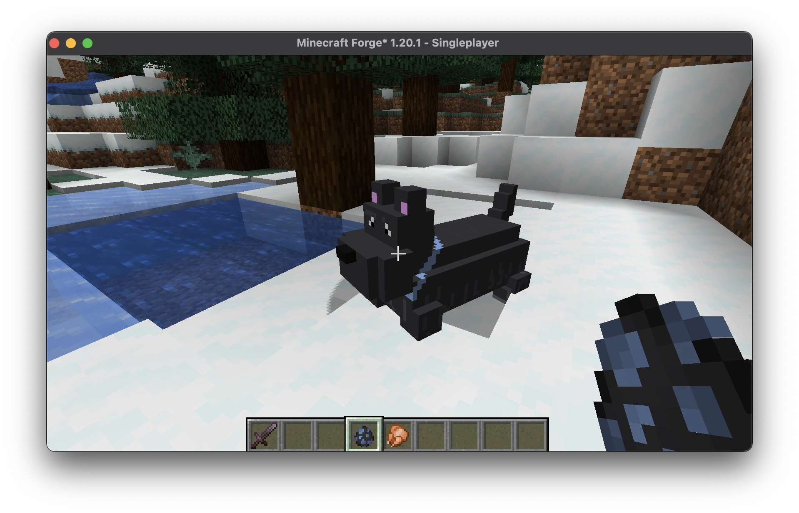

# Prospero 🪄

## Overview
This is [Prospero](https://en.wikipedia.org/wiki/Prospero), a project focused in implementing really "intelligent" 🧠
mobs in Minecraft, using Reinforcement Learning (RL).

## The Idea 
I have decided to learn to program in Java, and what better way to do it than using one of my favorite video games; Minecraft.
It has occurred to me to implement a mob that has a more complicated system than the default system of [goals](https://learn.microsoft.com/en-us/minecraft/creator/reference/content/entityreference/examples/aigoallist?view=minecraft-bedrock-stable) in Vanilla Minecraft, it is important to mention that as interesting as this idea is, implementing an RL model in Minecraft is a great challenge, since model the observation space in a game that does not have a specific purpose, a sandbox.

## Current State

Currently I have managed to implement two custom mobs, one I have modeled and created its behavior myself, now I am developing a way to incorporate deep learning models into the mod.

## To Do

- Start with implementing simple mob, in a super simple game.
- Create an autonomous mob, that can be trained in a *small* number of episodes.
- Design and animate the mob.

## Technologies

I'm actually developing this mod using Forge for Minecraft 1.20 and the IntelliJ IDEA Community Edition. Later on, I will search for how to build and release the mod, so everyone can install it easily! 

 
